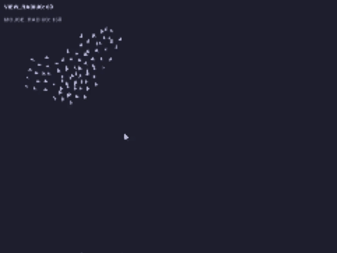

# BoidsPythonPygame

A simple Python simulation of boids, bird-like agents that exhibit flocking behavior, using Tkinter for visualization. The simulation allows you to adjust parameters to modify how the boids behave and how they interact with the mouse pointer.

## 📌 What are Boids?

Boids is an artificial life program developed by Craig Reynolds in 1986 that simulates the flocking behavior of birds. The model is based on three simple rules:

- 🌀 Separation - Avoid crowding nearby boids.

- 📏 Alignment - Steer towards the average heading of neighbors.

- 📍 Cohesion - Move towards the average position of neighbors.

These simple rules lead to complex, emergent behavior that mimics the movement of real flocks.

For more details, check out:

- 📌 [Craig Reynolds' Boids Page](https://www.red3d.com/cwr/boids/)
- 📖 [Wikipedia - Boids](https://en.wikipedia.org/wiki/Boids)
- 📘 [The Nature of Code - Flocking](https://natureofcode.com/book/chapter-6-autonomous-agents/#chapter06_section7)


## Features

- Adjustable boid visibility

- Mouse interaction🖱️: Boids can be attracted to or repelled by the mouse

- Real-time parameter tuning for speed, alignment, cohesion, and separation

  


## 🛠️ Installation

To run the simulation, ensure you have Python 3.x installed. Then, clone the repository and run the script:

```bash
# Clone this repository
git clone https://github.com/Diegobr21/BoidsPythonPygame.git
cd BoidsPythonTkinter


# Run the simulation
python boids.py

```

## 📦 Dependencies

This project only requires the standard Python library, specifically Tkinter.

## Usage

▶️ Run python boids.py to start the simulation.

🎛️ Use the keyboard arrows to adjust behavior parameters.

🖱️ Move the mouse to interact with the boids.

## 🔮 Future Improvements

- 🚧 Add obstacles to navigate around

- 🎨 Improve visualization with better graphics
